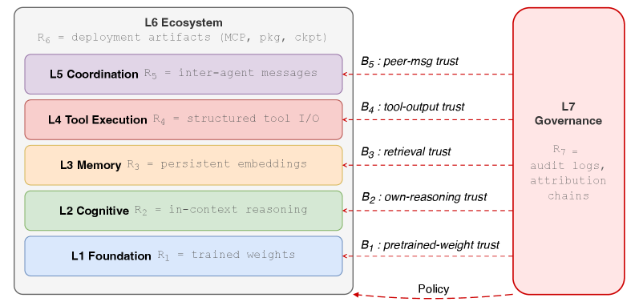

过去忙于个人项目（git小号） 许久没有来更这里~ 依旧保持着好奇心和想学习各种知识的心态。
超级有趣的一年 :) 趣味性大满足，接下来要继续沉下心学习啦

# A Systematic Survey of Security Threats and Defenses in LLM-Based AI Agents 学习笔记

原文： https://arxiv.org/html/2604.23338v2

## 概括/阅读

### 7层模型的提出

摘要总结：

提出了7层模型（LASM) 来理解agent安全

并且将过去涉及到agent安全的论文进行分类和规划到四象限的网格中

- Foundation
- Cognitive - 导 Agent 偏离原本的任务规划
- Memory - 对应攻击面：*Data/Knowledge Poisoning, Indirect Prompt Injection*
- Tool Execution - 对应攻击面的总结*Tool Poisoning*
- Multi-Agent Coordination - 对应攻击面：*Multi-Agent Collusion*
- Ecosystem
- Goverance

引言： 

agent比聊天模型更容易被攻击

供给多为组合型的 并且这些供给在传统的LLM安全和软件并没有新模型的给出：

1. 攻击来自于授权行为的组合
2.  一个组件无法检测经过另一个组件的供给 
3.  攻击是时间延续的: 一个payload可以在执行前几周安装

### 论文研究的问题：

 本调查围绕SoK（知识体系化）和RQs（五个研究问题）

RQ1 能否按攻击部分分类

RQ2 时间攻击 分类

RQ3 众人研究方向： 都在研究简单的瞬时攻击 ，系统性的，长期潜伏 攻击研究很少

RQ4 防御的覆盖率

RQ5 哪些是工程问题 哪些是学术界的基础研究

## 阅读重点：

- Figure 5（LASM架构图）
- Figure 7 和 Figure 8（攻击与防御的热力图）
- Table 8

### Figure 5

L2:  Prompt Injection（提示注入） 和 越狱（Jailbreak）

L3: agent 历史记忆 RAG数据库注入

L4： 恶意工具执行

L5： 多智能体协同工作，攻击其中一个agent，感染高权限agent

L6: 供应链安全

防御特点：

- 防御的非传递性（Non-transferability): 一层部署防御，对另一层攻击完全无效
- B1-B5 导致威胁的信任根源

### Figure 7

攻击方向研究热点图

纵轴： 7层模型

横轴： 时间维度，分别从T1到T4（瞬时，会话持久，跨会话积累，子会话栈/底层潜伏）

- {**L1,L2 } × {T1, T2 } ：** 当前大部分安全研究重点
- **{L5, L6, L7} × {T3, T4} ：** 被大部分安全研究忽略的点
- **{L3, L4}** : 研究方向向T3和T4蔓延： L3×T3（记忆投毒），L4×T4（工具链后门）

### Figure 8

防御方向研究热点图

纵轴： 7层模型

横轴： 时间维度，分别从T1到T4（瞬时，会话持久，跨会话积累，子会话栈/底层潜伏）

- {l4} **×** {T4} 没有考虑工具潜伏攻击，例如Agent使用的第三方插件或API SDK存在后门
- {L5} **×**  {T4} 多agent通信协议（如MCP)本身存在漏洞，Agent之间信任链被长期劫持
- {L6} **×** {T3}: 供应链某个组件被污染 导致 Agent 在长期运行中逐渐泄露数据。

注意： {L1}**×** {T2,T3} 不存在T2和T3维度的攻击面（L1是无状态的）， {L1} × {T4}则是传统安全的攻击面

特点：

当前防御高度集中在L1 到 L3 

防御的建议：

1. 针对Agent调用外部Api： 工具链沙箱/代理
2. 建立多Agent零信任网关（针对{L5}**×**  {T4}）强制要求所有 Agent 之间的消息传递必须携带身份签名和权限令牌（Token）。
3. 引入 **Action-log schema（操作日志规范）** 和 **ABOM（Agent 物料清单）：** 在L7层记录完整的输入输出。可以溯源

### Table 8

列出了常见的攻击手段位于表格中的位置

根据table 8 做了一张图

## 关于AI Agent攻击面的学习
### Prompt Injection（提示注入）

定义：通过精心设计的输入操纵 Agent 的提示或指令，使其执行攻击者意图的操作，绕过原有安全约束。
应用场景：用户输入、工具调用描述、系统提示覆盖，导致 Agent 泄露敏感信息、执行恶意操作或越权行为。CITE_2 CITE_4Tool 

### Manipulation / Tool Poisoning（工具操纵/工具投毒）

定义：攻击者污染或劫持 Agent 可使用的外部工具（如 API、插件、搜索引擎），导致 Agent 调用被篡改的工具。
应用场景：Agent 依赖第三方工具进行网页浏览、代码执行、数据库查询时，被诱导调用恶意工具或返回伪造结果。CITE_1 CITE_2

### Indirect Prompt Injection（间接提示注入）

定义：攻击者将恶意提示隐藏在外部数据源（如网页、文档、数据库）中，当 Agent 读取这些内容时触发注入。
应用场景：Agent 进行 RAG（检索增强生成）、网页浏览或处理用户上传文件时，中招概率极高。CITE_2 CITE_4

### Privilege Escalation（权限提升）

定义：Agent 通过多步推理或工具组合，逐步提升自身可操作权限，最终执行高危操作。
应用场景：企业内部 Agent 拥有多工具权限时，被诱导从低权限操作逐步演变为删除数据、发送邮件等破坏行为。CITE_3 CITE_4

### Data Poisoning / Knowledge Poisoning（数据投毒/知识投毒）

定义：污染 Agent 的长期记忆、向量数据库或训练数据，使其在未来任务中输出偏向攻击者目标的内容。
应用场景：企业知识库 Agent、个人记忆型 Agent 被长期投毒后，持续输出错误决策或泄露信息。CITE_1

### Multi-Agent Collusion / Agent-to-Agent Attack（多 Agent 共谋攻击）

定义：多个 Agent 之间相互交互时，其中一个被攻破后感染其他 Agent，形成攻击链。
应用场景：企业部署的 Agent 集群、自动化工单处理流程、分布式 Agent 系统。CITE_2 CITE_4

### Over-Refusal Bypass & Jailbreaking（越狱与过度拒绝绕过）

定义：使用特殊角色扮演、编码、翻译等方式绕过 Agent 的安全对齐机制。
应用场景：测试阶段或生产环境中，攻击者通过复杂提示让 Agent 执行本应拒绝的危险指令。CITE_3

### Action Hijacking / Goal Hijacking（行动劫持/目标劫持）

定义：改变 Agent 的最终执行目标，使其偏离原始用户指令。
应用场景：自动化办公 Agent、交易 Agent、代码生成 Agent 被诱导执行完全不同的任务。CITE_2

### Memory Poisoning & Persistent Backdoor（记忆投毒与持久后门）

定义：在 Agent 的长期记忆中植入后门提示，使其在后续多次对话中持续保持恶意状态。
应用场景：个人助理 Agent、企业客服 Agent 等具有记忆功能的长期运行系统。CITE_1 CITE_4