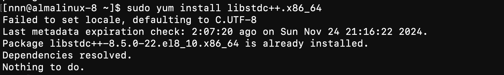

---
title: playwright环境(centos)
date: 2025-11-25 15:24:49
tags: [scrapy, 爬虫, playwright]
published: true
---    


# playwright环境(centos)

### 装libstdc/升级gcc

参考：https://stackoverflow.com/questions/70155008/how-to-install-devtoolset-8-in-rhel-8-image

1. 用轻量级包管理microdnf

`sudo dnf install microdnf` 

1. 使用microdnf装gcc-toolset
`microdnf install -y gcc-toolset-12`
2. 启用一个名为gcc-toolset-12的软件集合
`scl enable gcc-toolset-12 bash`
3. 装libstdc++
    
    `sudo yum install libstdc++.x86_64`
    
    
    

### 升级make

```bash
sudo dnf -y install make
```

### 设置UTF-8

```bash
yum -y install glibc-locale-source glibc-langpack-en
sudo localedef -c -f UTF-8 -i en_US en_US.UTF-8
export LC_ALL=en_US.UTF-8

```

### 下载依赖

```bash
dnf install -y alsa-lib \
at-spi2-atk \
at-spi2-core \
atk \
bash \
cairo \
cups-libs \
dbus-libs \
expat \
flac-libs \
gdk-pixbuf2 \
glib2 \
glibc \
gtk3 \
libX11 \
libXcomposite \
libXdamage \
libXext \
libXfixes \
libXrandr \
libXtst \
libcanberra-gtk3 \
libdrm \
libgcc \
libstdc++ \
libxcb \
libxkbcommon \
libxshmfence \
libxslt \
mesa-libgbm \
nspr \
nss \
nss-util \
pango \
policycoreutils \
policycoreutils-python-utils \
zlib
```

## 测试code

```python
def playwright_test():
    from playwright.sync_api import sync_playwright
    with sync_playwright() as pw:
        browser = pw.chromium.launch(headless=True``)
        context = browser.new_context(viewport={"width": 1920, "height": 1080})
        page = context.new_page()

        page.goto("https://twitch.tv/directory/game/Art")  # go to url
        page.wait_for_selector("div[data-target=directory-first-item]")  # wait for content to load

        parsed = []
        stream_boxes = page.locator("//div[contains(@class,'tw-tower')]/div[@data-target]")
        for box in stream_boxes.element_handles():
            parsed.append({
                "title": box.query_selector("h3").inner_text(),
                "url": box.query_selector(".tw-link").get_attribute("href"),
                "username": box.query_selector(".tw-link").inner_text(),
                "viewers": box.query_selector(".tw-media-card-stat").inner_text(),
                # tags are not always present:
                "tags": box.query_selector(".tw-tag").inner_text() if box.query_selector(".tw-tag") else None,
            })
        for video in parsed:
            print(video)
if __name__ == "__main__":
    playwright_test()
```
正常返回则证明可以。

## 参考：

- https://github.com/microsoft/playwright/issues/9199